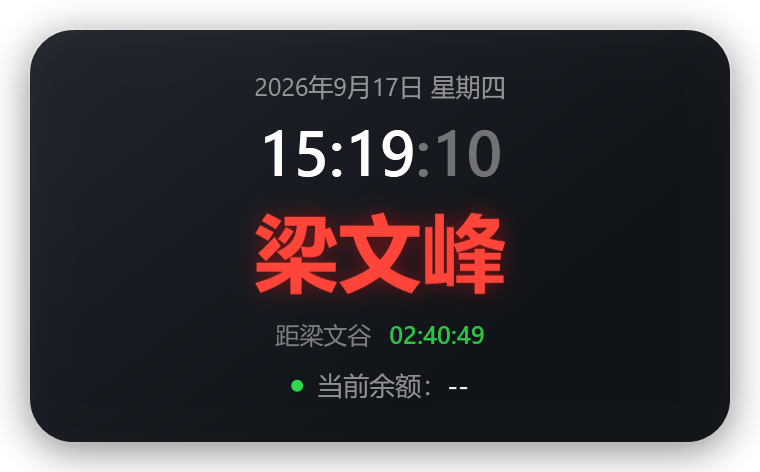
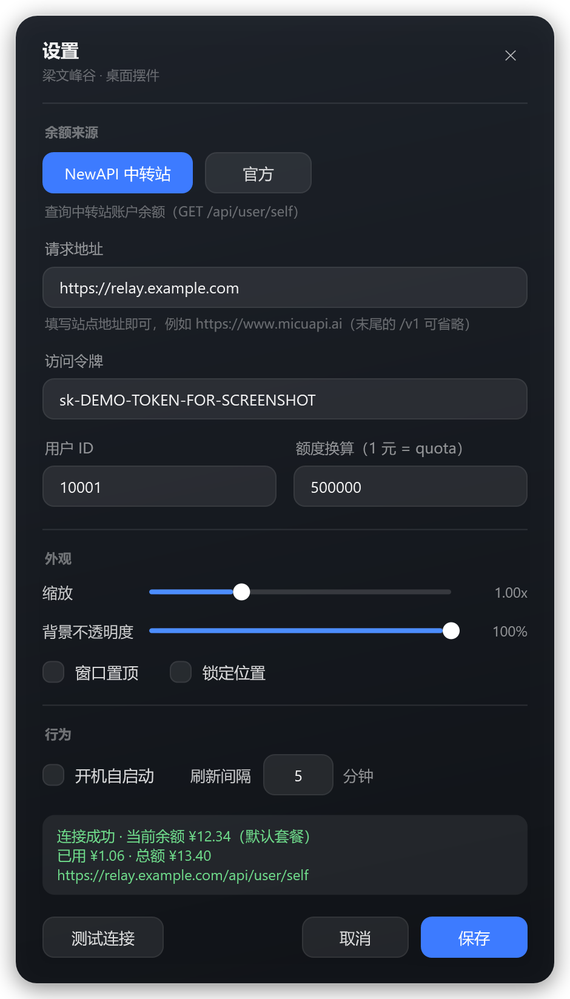

# 梁文峰谷 · 桌面摆件

一个 Windows 桌面小摆件：日期 / 星期 / 实时时钟 / 当前时段对象 / 切换倒计时 / AI 账户余额。

单文件 exe，基于 .NET Framework 4.x（Windows 自带，无需额外安装运行时），源码全部由 `csc.exe` 直接编译，不依赖 Visual Studio 或 NuGet 包。





## 功能

- **时钟与倒计时**：显示日期、星期、`时:分:秒`，以及距下一次时段切换的倒计时（超过 24 小时会带天数）。
- **时段对象**：工作日 `09:00–12:00` / `14:00–18:00` 显示红色的「梁文峰」，其余时间显示绿色的「梁文谷」，名字带发光效果，倒计时颜色跟着目标对象走。
- **余额显示**：支持两种余额来源，随时切换（见下）。
- **桌面组件行为**：默认不置顶，打开其他软件时被正常盖住；回到桌面（点桌面空白处、`Win+D`）仍然在原位。勾选「窗口置顶」可变回常驻悬浮摆件。
- **外观可调**：滚轮缩放（0.60x ~ 2.00x）、`Ctrl + 滚轮` 或设置里的滑杆调**背景不透明度**（文字始终完全不透明）。
- **托盘图标**：显示/隐藏、设置、立即刷新余额、余额来源、窗口置顶、锁定位置、开机自启动、退出。
- **开机自启动**：写入 `HKCU\Software\Microsoft\Windows\CurrentVersion\Run`。
- **单实例**：重复双击 exe 不会开第二个窗口，而是唤醒已有摆件。
- **命令行**：`--show` / `--check` / `--diag` / `--selftest` / `--render-live` / `--autostart on|off|status`。

## 余额来源（二选一）

设置窗口顶部切换，右键菜单和托盘菜单里也能切，切换后立即重新查询。

| 模式 | 用途 | 需要填写 |
| --- | --- | --- |
| **NewAPI 中转站** | 中转站账户余额 | 请求地址 / 访问令牌 / 用户 ID / 额度换算 |
| **官方** | 官方站点账户余额 | 官方地址 / 官方 API Key |

NewAPI 模式调用 `GET {请求地址}/api/user/self`，请求头 `Authorization: Bearer {访问令牌}`、`New-Api-User: {用户 ID}`，余额按「额度换算」换算成金额（默认 `500000 quota = 1 元`）。

官方模式按站点自动匹配接口：

| 官方站点 | 接口 |
| --- | --- |
| DeepSeek `https://api.deepseek.com` | `GET /user/balance` |
| SiliconFlow `https://api.siliconflow.cn` | `GET /v1/user/info` |
| OpenRouter `https://openrouter.ai` | `GET /api/v1/credits` |
| Novita `https://api.novita.ai` | `GET /v3/user/balance` |

货币符号跟随接口返回（CNY→`¥`、USD→`$`）；悬停摆件可看到来源名称与充值/赠送余额明细。

## 快速开始

1. 下载 `LiangWenFengGu.exe`，放到任意可写目录（例如 `D:\LiangWenFengGu\`）。
2. 双击运行，右键摆件 → **设置**，选择余额来源并填写连接信息，点「测试连接」确认能取到余额后保存。
3. 想开机自动启动，勾选设置里的「开机自启动」，或在托盘菜单里勾选。

首次运行会在 exe 同目录生成 `config.json`（若该目录不可写，则回退到 `%APPDATA%\LiangWenFengGu\config.json`）。

## 隐私说明

**令牌与 API Key 只保存在本机 `config.json` 里**，程序只会把它们发给你自己填写的那个站点，没有任何遥测或上报。发布/分享本程序时请勿附带自己的 `config.json`（仓库的 `.gitignore` 已忽略该文件）。

## 从源码编译

需要 Windows 自带的 .NET Framework 4.x 编译器（`C:\Windows\Microsoft.NET\Framework64\v4.0.30319\csc.exe`），无需安装 SDK。

```powershell
cd src
powershell -ExecutionPolicy Bypass -File .\make-icon.ps1   # 生成图标（可选）
powershell -ExecutionPolicy Bypass -File .\build.ps1       # 编译到 src\dist\LiangWenFengGu.exe
```

编译产物在 `src\dist\LiangWenFengGu.exe`。

自检（覆盖 09/12/14/18 点边界、午休、周末共 11 个用例）：

```powershell
.\LiangWenFengGu.exe --selftest
```

## 项目结构

```
src/
  Program.cs          入口、命令行、单实例、自检
  WidgetWindow.cs     摆件窗口：时钟、倒计时、余额、菜单、缩放与不透明度
  SettingsWindow.cs   设置窗口逻辑
  BalanceClient.cs    余额查询（NewAPI / 官方站点）
  AppConfig.cs        配置读写（config.json）
  ClockService.cs     时区与时段规则（Asia/Shanghai）
  DesktopFocus.cs     桌面图层识别，回桌面时把摆件抬到普通窗口最上层
  AutoStart.cs        开机自启动注册表
  Diagnostics.cs      日志与运行环境诊断
  TrayRenderer.cs     托盘图标渲染
  Xaml/               Widget.xaml / Settings.xaml 界面
  build.ps1           编译脚本
```

## 已知限制

- 仅支持 Windows；界面为简体中文。
- 官方模式目前覆盖 DeepSeek / SiliconFlow / OpenRouter / Novita 四家的余额接口。
- 余额刷新间隔最小 1 分钟。

## 致谢

灵感来自 [gggxbbb/m5-workspace · liangzi-meter](https://github.com/gggxbbb/m5-workspace/tree/master/liangzi-meter)：
把「梁文峰 / 梁文谷」的时段切换做成一个常驻桌面的小摆件。

本项目是把这个想法搬到 Windows 桌面上的独立实现，**界面与代码均为自行编写，没有使用原项目的代码**。
如果你喜欢这个点子，欢迎去给原项目点个 Star。

## License

[MIT](LICENSE)
